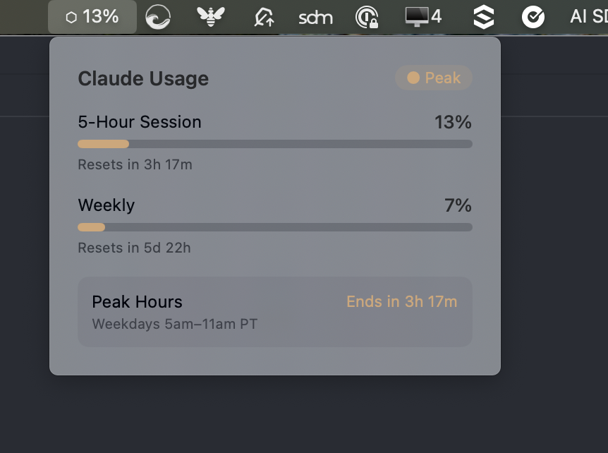

# Claude Usage

A macOS menu bar app that shows your Anthropic (Claude) subscription usage at a glance.

> **Disclaimer:** This is a vibe-coded app I made for myself. It works for me on macOS 15. No guarantees, no support, no roadmap. If it works for you too, great.



## What it does

- Shows your 5-hour session usage percentage in the menu bar
- Click to expand a popover with:
  - 5-hour session usage with reset countdown
  - Weekly usage with reset countdown
  - Peak/off-peak indicator (weekdays 5am-11am PT)
  - Extra usage spend (if enabled on your account)
- Polls the Anthropic usage API every 3 minutes
- Menu bar text shifts to orange during peak hours

## Requirements

- macOS 15.0+
- An active Claude Pro or Max subscription
- Claude Code installed and authenticated (the app reads your OAuth token from the macOS Keychain)

## Install

### From release

1. Download `ClaudeUsage-1.1.3.zip` from [Releases](https://github.com/aarongraham/claude-usage/releases)
2. Unzip and drag `ClaudeUsage.app` to `/Applications`
3. Open it. If macOS blocks it, go to System Settings > Privacy & Security and click "Open Anyway"

### From source

```bash
git clone https://github.com/aarongraham/claude-usage.git
cd claude-usage
make install
```

Requires Xcode or Xcode Command Line Tools with Swift 6.0+.

## How it works

The app reads your Claude Code OAuth token by shelling out to `/usr/bin/security find-generic-password -s "Claude Code-credentials" -w`, then calls `GET https://api.anthropic.com/api/oauth/usage` for your current usage. No API keys are stored in the app — it piggybacks on your existing Claude Code authentication. Going through `/usr/bin/security` (instead of reading the keychain directly from this app) avoids the recurring "ClaudeUsage wants to access your keychain" prompt that otherwise appears every time Claude Code rotates its OAuth token.

## License

MIT
